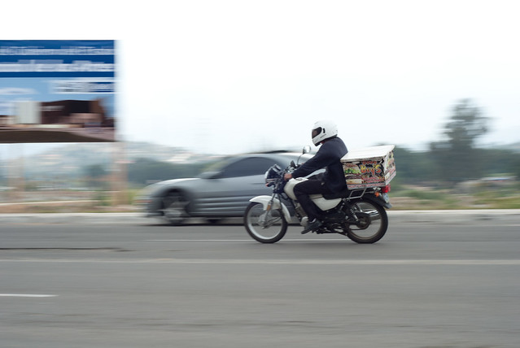
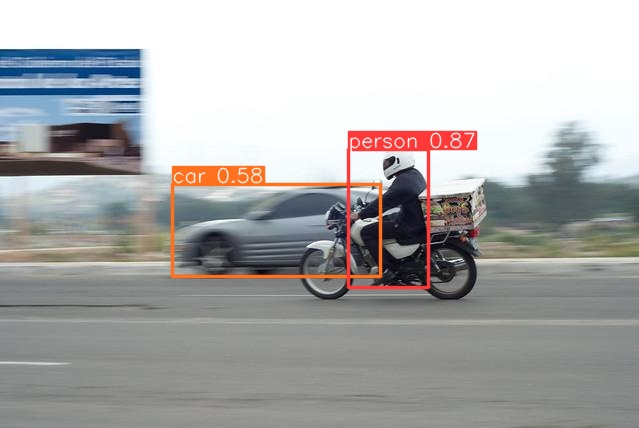

# Turing Challenge technical interview 
Author: Vicent Gilabert Mañó  
[Linkedin](https://www.linkedin.com/in/vgilabert/) | [Github](https://github.com/vgilabert94) | [Website](https://vgilabert94.github.io/)

### Section 1
**Local service for object detection. The objective is to have a service that has an image as input and provides a JSON with car and people detections as output.** The following points must be met:
- There is no need to train a model. Pre-trained models can be used.
- The service must be containerised. That is, a docker image that exposes the service on startup.
- The request to the service can be made from Postman or similar tool or from Python code.
- The solution must be implemented in Python.

#### **Proposed solution**  
To create an object detector (cars and pedestrians), we can use different techniques and algorithms. Starting with the classics of computer vision, there are algorithms such as HoG (Histogram of Gradients) + SVM (Support Vector Machine) that can be used to detect people and cars with minimal training.  
Currently, the state of the art is in deep learning models such as YOLO (You Only Look Once), SSD (Single Shot MultiBox Detector), Faster R-CNN, among others. For our problem we will use YOLO with the ultralytics python library. Training will not be necessary as it provides us with the weights to perform the inference.

- client.py --> Client file to send a request of image using flask.
- object_detector_app/server.py --> Server file to recieve an image in base64 using flask and procces image using detector.py.
- object_detector_app/detector.py --> ObjectDetector class to process image for detect object using YOLO (Ultralytics).
    - About this model (YOLO) is trained with 80 classes of objects (COCO Dataset). In our case, we only need person and car (0 and 2).
    - In order to create an efficient solution, we could re-train with only the needed classes or keep only the neurons for this classes. 

Build a docker image or use one from docker hub:  
```bash
cd object_detector_app
docker build --no-cache -t object_detector_app .
```
```bash
docker pull vgilabert94/object_detector_app
```
Run docker container to start our server.py app:
```bash
docker run -p 5000:5000 object_detector_app
```

In other bash console, launch client.py file to start the object detection algorithm. If you want to change the image, you can modify this file.
```bash
python client.py
```


Result is a dictionary with this format: {image_name, num_objects, objects: {class, confidence, bbox}}

<div style="display: flex;">
    
    
</div>


### Section 2
**Starting from the development, libraries and technologies used in section 1. Propose the necessary steps to train a detection model with categories that do not exist in pre-trained models.** The points on which to focus the explanation are:
- Necessary steps to follow.
- Description of possible problems that may arise and measures to reduce the risk.
- Estimation of amount of data needed as well as expected results, metrics.
- Enumeration and short description (2-3 sentences) of techniques that can be used to improve performance, model metrics at training time and model metrics at inference time.

#### **Proposed solution**
To train a new class, you need to follow these steps:
1. **Collect Data**: Gather a dataset containing images of the new class along with their corresponding labels, which may involve manual collection and annotation or leveraging existing datasets. 
2. **Data Preparation**: Divide the labeled data into training, validation, and test sets, and perform preprocessing tasks such as resizing and data augmentation to improve model generalization.
3. **Base Model Selection and Adaptation**: Choose a pre-trained model (in our case YOLO) and adjust its output layer to accommodate the new class.
4. **Model Training**: Train the adapted model using optimization techniques like stochastic gradient descent or Adam to minimize a loss function based on the prepared dataset.
5. **Model Evaluation**: Assess the performance of the trained model on an independent test dataset to evaluate its ability to generalize to unseen data effectively.
6. **Hyperparameter Tuning**: Fine-tune the model's hyperparameters, such as learning rate and batch size, to optimize its performance during training.  

Problems that we could have during training:  
1. Lack of Data: If there are insufficient labeled data to train an effective model, transfer learning can be employed. This technique leverages a pre-trained model as a starting point and fine-tunes it to adapt to the specific dataset, requiring fewer labeled examples.
2. Data Quality Issues: Ensuring that data is clean and accurately labeled is crucial. Manual inspection and correction of mislabeled data can help mitigate this problem, ensuring that the model learns from reliable information and improves its performance.
3. Overfitting: Occurs when the model becomes too specialized in the training data and fails to generalize well to unseen data. Techniques such as data augmentation, regularization (e.g., L2 regularization), and reducing the learning rate can help mitigate this risk by encouraging the model to learn more generalizable features.

When estimating how much data we need and what results to expect, it's important to consider the complexity of the new categories and how much they vary. This could mean we need hundreds or even thousands of data points.   
In the evaluation stage, we need to carefully analyze how well our algorithm is performing. Using specific metrics like accuracy, precision, recall, and F1 score helps us understand how good our model is at detecting objects and finding the right balance between precision and recall. We also look at metrics like Intersection over Union (IoU), Mean Average Precision (mAP), and Mean Average Recall (mAR) to see how well our model performs across different situations and types of objects.

Improving performance:  
As I have discussed in this section, there are a few techniques we can use for improve results. For example, transfer learning lets us take a pre-trained model and adjust it to recognize our new categories. Data augmentation is another useful technique, where we make our training data more diverse by applying random changes to the images. We can also use methods like L2 regularization to stop our model from getting too focused on the training data and batch normalization to speed up the training process. Finally, ensemble learning combines predictions from multiple models to make our overall results more reliable and robust. By using these techniques, we can make sure our object detection models work well in a wide range of situations.


### Section 3 (optional)
**Explain how case 2 would be adapted to edge processing.** The points on which to focus the explanation are:
- Necessary steps to be taken.
- Description of possible problems that may arise and measures to reduce the risk.
- Estimation of amount of data needed as well as expected results, metrics.
- Enumeration and short description (2-3 sentences) of techniques that can be used to improve performance, model metrics at training time and metrics and runtime at inference time.

#### **Proposed solution**

I'm not an expert in edge computing, but it's an area that I find really interesting and want to keep learning about. 
- In this situation, we need to use basic computer vision algorithms or optimized deep learning models like light, tiny, or mobile versions because the resources for computation and memory are limited.  
- We might also face some challenges with connectivity and power, especially if we're dealing with battery-powered devices.  
- To make our edge computing performance better, we can try techniques like Quantization, which reduces the precision of model parameters without losing much accuracy. Another thing we can do is train our models using data that reflects real-world edge environments, which can help them perform better and be more robust.
